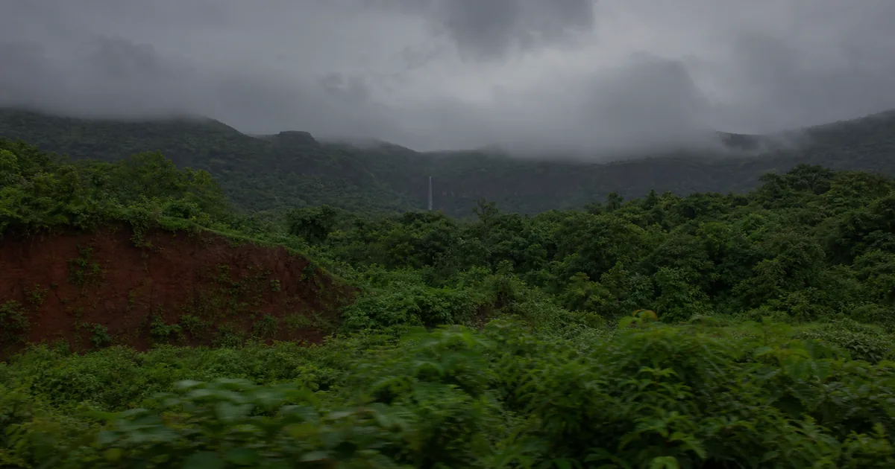

# WindowSeat V2



**The journey begins outside your window.**

WindowSeat V2 is a full-screen, cinematic train-window simulator built around original photorealistic scene plates, depth-separated motion, a tactile coach interior, gradual weather and light treatment, and user-initiated spatial ambience. The simulator is the homepage: there is no marketing page between the visitor and the window.

Production URL: [https://windowseat-v2.vercel.app](https://windowseat-v2.vercel.app)

## Experience

- Six curated, region-inspired journeys with reproducible human-readable seeds
- Four materially different coach environments: Classic Sleeper, AC First, Modern Express, and Open Luggage View
- Layered photographic parallax with slow scene crossfades and image fallback recovery
- Clear, overcast, rain, monsoon, fog, storm, and route-safe snow conditions
- Dawn through night treatments, with visitor lock and natural progression
- Speed-aware rain glass, restrained reflections, rare route events, and coach-specific movement character
- User-initiated Web Audio layers for train rhythm, cabin hum, wind, and weather
- URL-restorable journeys, native sharing with clipboard fallback, and same-origin image capture
- Cinematic, Balanced, and Data Saver quality modes
- Keyboard, touch, reduced-motion, hidden-tab pause, and static-scene support

The regional route names describe artistic inspiration. Generated scene plates are not documentary claims of geographic accuracy.

## Routes

1. Konkan Monsoon
2. Odisha Green Corridor
3. Himalayan Dawn
4. Rajasthan Twilight
5. Bengal Countryside
6. Southern Coast

## Controls

The compact sill controls appear after pointer movement, touch, or keyboard focus and recede during the journey. Detailed controls live in the settings drawer.

| Key       | Action                                     |
| --------- | ------------------------------------------ |
| `F`       | Toggle focus mode                          |
| `M`       | Toggle sound                               |
| `R`       | Start a random journey                     |
| `C`       | Capture the current window                 |
| `S`       | Open native share or copy the journey link |
| `←` / `→` | Adjust train speed                         |
| `Escape`  | Exit focus mode or close an overlay        |

## Architecture

WindowSeat V2 uses Vite, strict TypeScript, semantic DOM/CSS for the cabin and controls, Canvas 2D for weather glass, HTML image layers for route media, and Web Audio for locally synthesised ambience. It has no backend and makes no generative API calls at runtime.

```text
src/
├── app/        state, persistence, URL restoration, application shell
├── audio/      user-initiated layered Web Audio engine
├── data/       typed routes, coaches, weather and scene manifests
├── effects/    adaptive quality and Canvas rain glass
├── journey/    deterministic seeds and route scheduling
├── media/      lazy scene loading, depth composition and fallback
├── styles/     cabin, controls, onboarding and responsive systems
├── types/      shared contracts
└── ui/         icons, capture and sharing
```

Only the active scene is loaded eagerly. The next likely scene is prefetched, obsolete load callbacks are ignored, device pixel ratio is bounded, route video is not required, and Data Saver uses smaller WebP posters with a single static layer. Media and audio pause when the page is hidden.

## Local development

Requires Node.js 20 or newer.

```bash
npm install
npm run dev
```

Open <http://127.0.0.1:3000>.

## Quality checks

```bash
npm run format:check
npm run lint
npm run typecheck
npm test
npm run build
```

The test suite covers deterministic seeds, transition scheduling, URL parsing and recovery, persistence, quality selection, media fallback, hidden-tab motion pause, keyboard controls, sharing, capture dimensions, and licence-manifest validation.

## Vercel deployment

Vercel can detect the Vite configuration automatically:

- Install command: `npm install`
- Build command: `npm run build`
- Output directory: `dist`

No runtime environment variables or backend services are required.

## Media and licences

Production media is served locally and is safe for same-origin capture. The complete human-readable record is in [ASSET_LICENSES.md](ASSET_LICENSES.md); the machine-readable record is in [public/media/asset-manifest.json](public/media/asset-manifest.json).

No Google Images downloads, YouTube footage, social-media videos, stock watermarks, official railway logos, copyrighted music, or announcements are bundled.

## Accessibility

The interface uses semantic buttons and form labels, visible focus states, keyboard operation, touch-sized controls, route-condition text for assistive technology, optional audio, bounded low-frequency lightning, reduced-motion support, and no disabled browser zoom. Mobile portrait and landscape layouts are designed independently from the desktop sill.

## Technical limitations

- Current route media consists of original generated still scene plates and derivatives; licensed lateral train footage would add further temporal realism in a future media pass.
- Night treatment is reserved and intentionally avoids pretending that bright daylight imagery is true low-light footage. A future update should add dedicated low-light plates before expanding night routes.
- Audio is procedural rather than field-recorded. Carefully licensed Indian rolling-stock recordings would improve mechanical authenticity.
- Capture exports widescreen JPEG in the default interface; the capture engine also supports a square composition for a future UI option.

## Licence

Source code is released under the repository's [MIT licence](LICENSE). Generated media is documented separately in [ASSET_LICENSES.md](ASSET_LICENSES.md).
